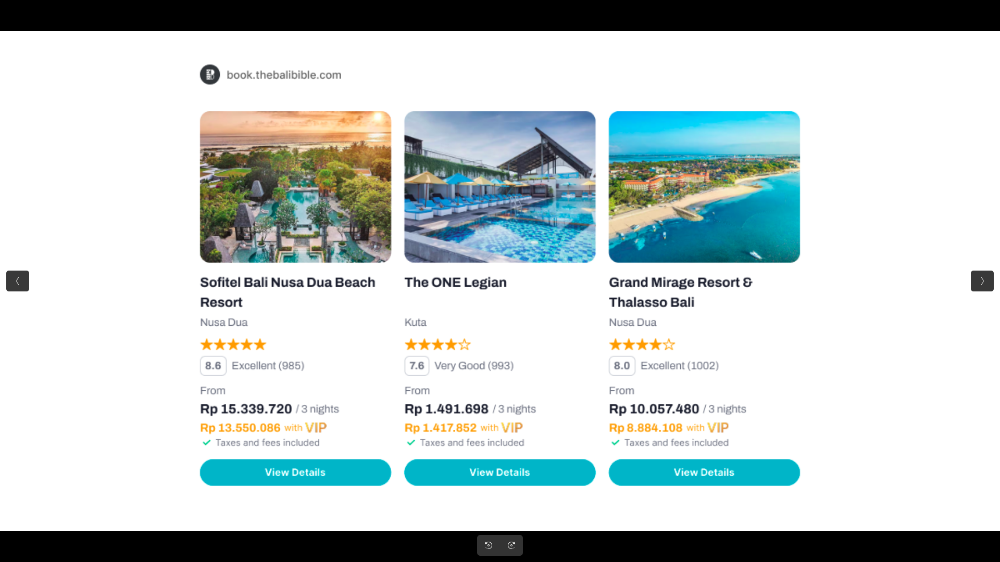

# Hackathon TODO — Hotel Search Widget (ChatGPT App)

## Stack
- **Widget**: React + TypeScript + Tailwind v4 (Vite, built to single HTML)
- **Map**: react-leaflet + Leaflet.js
- **MCP Server**: .NET 8 (existing)

---

## How React + Tailwind fits into ChatGPT Apps

ChatGPT renders your widget from a **single HTML file** served via MCP resource.
The trick: Vite builds your React app → `vite-plugin-singlefile` inlines all JS/CSS into one `list-hotel.html` → .NET reads that file and serves it as `ui://widgets/list-hotel.html`.

```
widget/src/  →  vite build  →  TravelAgent/Widgets/list-hotel.html
```

---

## Phase 1 — Widget Project Setup ✅

- [x] Create `widget/` folder at repo root
- [x] Init Vite + React + TypeScript project
- [x] Install dependencies (Tailwind v4, react-leaflet, vite-plugin-singlefile, @modelcontextprotocol/ext-apps)
- [x] Configure `vite.config.ts` — output to `TravelAgent/Widgets/list-hotel.html`
- [x] Tailwind v4 setup with `@import "tailwindcss"` in `index.css`

---

## Phase 2 — MCP App Data Integration ✅

> Replaced `window.__APP_DATA__` approach with official `@modelcontextprotocol/ext-apps` SDK.

- [x] Create `src/types/hotel.ts` — TypeScript types matching `SearchHotelResponse`
- [x] ~~`useAppData.ts`~~ → replaced by `useMcpApp.ts`
- [x] `src/hooks/useMcpApp.ts` — connects via `useApp()`, listens to `ontoolresult`, parses `structuredContent` with text fallback (mirrors Alpine.js logic)
- [x] Dev mock data pre-loaded when `import.meta.env.DEV` — no mock in production build
- [x] `App.tsx` calls `useHostStyles(app)` to sync MCP host theme to document

---

## Phase 3 — Hotel List View (Card Carousel) ✅

Design reference: `design-refs/hotel-card-design.png`



- [x] `src/components/HotelCard.tsx` — image, name, location, stars, guest rating, price, VIP price, CTA button
- [x] `src/components/HotelCarousel.tsx` — horizontal snap scroll, prev/next arrows
- [x] `ResizeObserver` on scroll container — cards fill available width with zero cut-off or partial cards
- [x] Scroll step synced to dynamic card width
- [x] Missing image fallback (🏨 emoji)
- [x] Tailwind v4 utility classes throughout

---

## Phase 3b — Theming ✅

- [x] CSS variable design token system (`--card`, `--primary`, `--muted`, `--border`, etc.)
- [x] `@theme inline` block maps tokens to Tailwind utilities (`bg-card`, `text-foreground`, etc.)
- [x] `@custom-variant dark ([data-theme="dark"] &)` — dark mode triggered by MCP SDK
- [x] Dark mode fully wired: `useHostStyles` → `applyDocumentTheme("dark")` → CSS vars switch → Tailwind `dark:` classes activate
- [x] Transparent outer background — widget blends with any host (ChatGPT, MCP Inspector)

---

## Phase 4 — Hotel Detail View

> **Context**: The MCP server exposes `get_hotels_detail` tool (in `HotelAssistantTool.cs`) that returns
> a rich `HotelDetail` object. When "View Details" is clicked, the widget calls this tool via
> `app.callServerTool()` and the result renders in the same widget (in-widget navigation).

Design reference: `design-refs/hotel-detail-design.png`


### How the detail flow works

```
User clicks "View Details" on a HotelCard
    → HotelCard calls onViewDetails(hotel) passed as prop
        → App.tsx calls app.callServerTool({ name: 'get_hotels_detail', arguments: { ... } })
            → MCP server fetches room rates + full detail
                → ontoolresult fires with HotelDetail data
                    → App.tsx switches view to 'detail'
                        → HotelDetailView renders
```

### Backend (small — coordinate with MCP developer)

- [ ] Add `GetHotelDetailWidget()` to `TravelAgent/MCP/Resources/WidgetResource.cs`
  - URI: `ui://hotel-detail-widget.html`
  - Serves `TravelAgent/Widgets/hotel-detail-widget.html` (for when AI calls tool directly)

### Frontend

**4.1 — Types**
- [ ] Add `HotelDetail` and `RoomRateInfo` to `src/types/hotel.ts`:
  ```ts
  export interface RoomRateInfo {
    roomName: string
    roomType: string
    imageUrl?: string
    bedConfiguration?: string
    mealsDescription?: string
    refundable: boolean
    freeCancellationUntil?: string
    price: number
    strikeThroughPrice?: number
    currency: string
  }

  export interface HotelDetail {
    id: string
    name: string
    starRating: number
    description?: string
    images: string[]
    amenities: string[]
    address?: string
    latitude?: number
    longitude?: number
    currency: string
    price: number
    roomRates: RoomRateInfo[]
  }
  ```

**4.2 — State management in `useMcpApp`**
- [ ] Extend `useMcpApp.ts` to:
  - Store `detailData: HotelDetail | null` and `detailLoading: boolean` in state
  - Detect result type: if result has `roomRates` → it's a `HotelDetail`, else it's `SearchHotelResponse`
  - Keep existing `hotels` / `meta` state untouched when a detail result arrives

**4.3 — Wire "View Details" button**
- [ ] Update `HotelCard.tsx` — add `onViewDetails?: (hotel: Hotel) => void` prop
- [ ] Update `HotelCarousel.tsx` — pass `onViewDetails` down to each card
- [ ] Update `App.tsx`:
  - Add `view: 'list' | 'detail'` state
  - `handleViewDetails(hotel)`:
    1. Set `detailLoading = true`, switch `view` to `'detail'`
    2. Call `app.callServerTool({ name: 'get_hotels_detail', arguments: { hotel_id: hotel.id, hotel_code: hotel.hotelCode, provider: hotel.provider, check_in: meta.checkIn, check_out: meta.checkOut, currency: meta.currency } })`
  - When `detailData` arrives from `useMcpApp`, clear `detailLoading`
  - Back button resets `view` to `'list'`

**4.4 — `HotelDetailView` component**
- [ ] Create `src/components/HotelDetailView.tsx`:
  - **Header**: back button (`‹ Back to results`), hotel name, star rating
  - **Image gallery**: horizontal scroll strip of all `images[]`
  - **Info row**: address, guest rating badge
  - **Description**: expandable text block
  - **Amenities**: wrapping pill/badge grid
  - **Room rates**: card list — each room shows name, bed config, meals, price, cancellation policy, "Book Now" CTA
  - **Loading skeleton**: shown while `detailLoading` is true

---

## Phase 5 — List / Map Toggle

- [ ] Create `src/components/ViewToggle.tsx` — "List" / "Map" tab buttons
- [ ] Wire toggle state in `src/App.tsx`
- [ ] Sync: clicking a card highlights its pin on map (optional)

---

## Phase 6 — Backend: Add Coordinates to Hotel Model

> Backend work — coordinate with MCP server developer.

- [x] `HotelDetail` already has `Latitude` and `Longitude` (available in detail view)
- [ ] Add `Latitude` and `Longitude` to `TravelAgent/Models/Hotel.cs` (for list view map pins)
- [ ] Populate from search API response in `TravelAgent/Services/HotelService.cs`

---

## Phase 7 — Build Integration

- [ ] Add build step to `TravelAgent/TravelAgent.csproj` so `dotnet build` also builds the widget:
  ```xml
  <Target Name="BuildWidget" BeforeTargets="Build">
    <Exec Command="npm run build" WorkingDirectory="$(MSBuildProjectDirectory)/../widget" />
  </Target>
  ```
- [ ] Test end-to-end: ChatGPT prompt → tool called → widget renders with map toggle

---

## Phase 8 — Polish (time permitting)

- [ ] Loading skeleton while waiting for tool result
- [ ] Animated map pin bounce on first load
- [ ] Cross-highlight: hover card ↔ highlight map pin

---

## Key Files

| File | Purpose |
|------|---------|
| `widget/src/App.tsx` | Root — view state, `handleViewDetails`, `useMcpApp`, `useHostStyles` |
| `widget/src/types/hotel.ts` | TypeScript types — `Hotel`, `HotelDetail`, `RoomRateInfo`, `SearchHotelResponse` |
| `widget/src/hooks/useMcpApp.ts` | MCP ext-apps connection + tool result parsing (list + detail) |
| `widget/src/index.css` | Tailwind v4 + CSS design tokens + dark variant |
| `widget/src/components/HotelCard.tsx` | Single hotel card — emits `onViewDetails` |
| `widget/src/components/HotelCarousel.tsx` | Responsive carousel with ResizeObserver |
| `widget/src/components/HotelDetailView.tsx` | _(next)_ Full detail page |
| `widget/src/components/HotelMap.tsx` | _(next)_ Leaflet map with pins |
| `widget/src/components/ViewToggle.tsx` | _(next)_ List/Map tab switch |
| `widget/vite.config.ts` | Vite + singlefile + Tailwind v4 config |
| `TravelAgent/Widgets/list-hotel.html` | Build output served by MCP resource |
| `TravelAgent/MCP/Resources/WidgetResource.cs` | MCP resources — add detail widget here |
| `TravelAgent/MCP/Tools/HotelAssistantTool.cs` | `search_hotel` + `get_hotels_detail` tools |
| `TravelAgent/Models/HotelDetail.cs` | `HotelDetail` + `RoomRateInfo` model |
| `TravelAgent/Models/Hotel.cs` | Add `Latitude`/`Longitude` here (Phase 6) |
| `design-refs/hotel-detail-design.png` | Detail view design reference |
| `design-refs/hotel-card-design.png` | Card design reference |
